<div align="center">


# 🥪 pbnj 📄

[](https://www.npmjs.com/package/@pbnjs/cli)
[](https://www.npmjs.com/package/@pbnjs/cli)
[](https://bundlephobia.com/package/@pbnjs/cli)
[](https://github.com/bhavnicksm/pbnj/stargazers)
[](https://github.com/bhavnicksm/pbnj/network/members)
[](./docs)
[](./LICENSE)

_pbnj is a simple, minimal self-hosted pastebin solution, focused on getting you started quickly and easily_

[Features](#-features) · [Why?](#-why) · [Cost](#-cost) · [Speedrun](#-speedrun-get-started-under-a-minute) · [Not a Feature](#-intentionally-missing) · [Acknowledgements](#-acknowledgements)

[](https://deploy.workers.cloudflare.com/?url=https://github.com/bhavnicksm/pbnj)

</div>

## ✨ Features

- 🎨 **Syntax highlighting** for 100+ languages with 12 beautiful themes
- 🧹 **Clean interface** — distraction-free, minimal design
- 🥪 **Memorable URLs** — `crunchy-peanut-butter-sandwich` instead of `x7f9a2`
- ⌨️ **CLI-first** — `pbnj file.py` and you're done
- 🌐 **Web interface** — create and delete pastes from the browser too
- 🔒 **Private pastes** — unlisted pastes with optional secret keys
- ☁️ **Edge-powered** — fast globally, free forever on Cloudflare
- ...and many more!

<details>
<summary>🎭 Theme Gallery</summary>

| | |
|:---:|:---:|
| 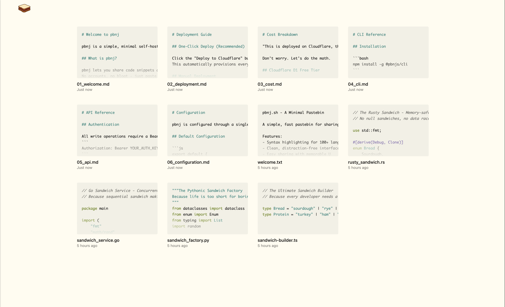 | 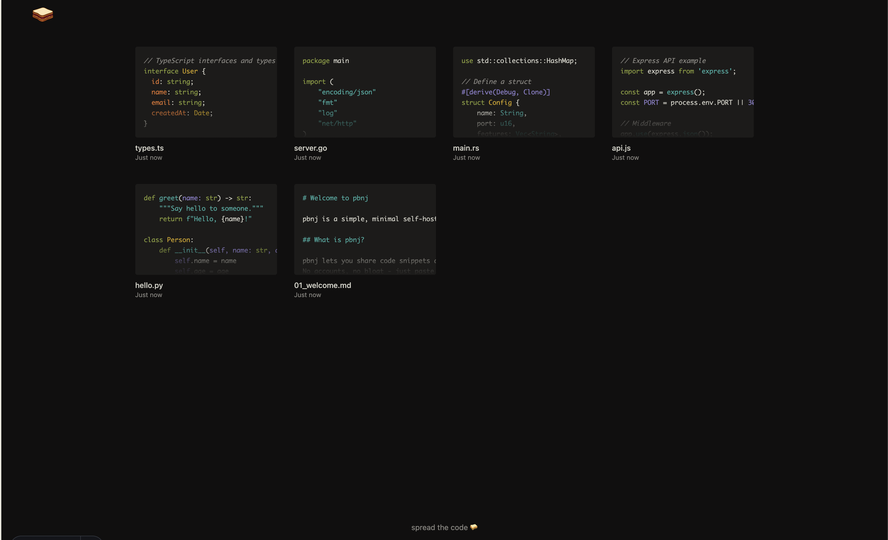 |
| Flexoki Light | Flexoki Dark |
| 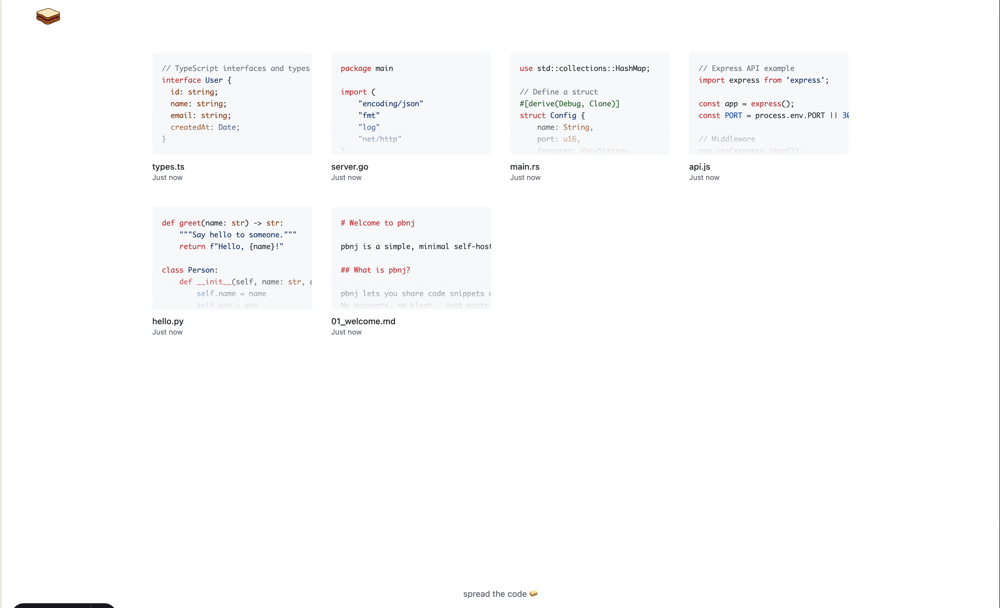 | 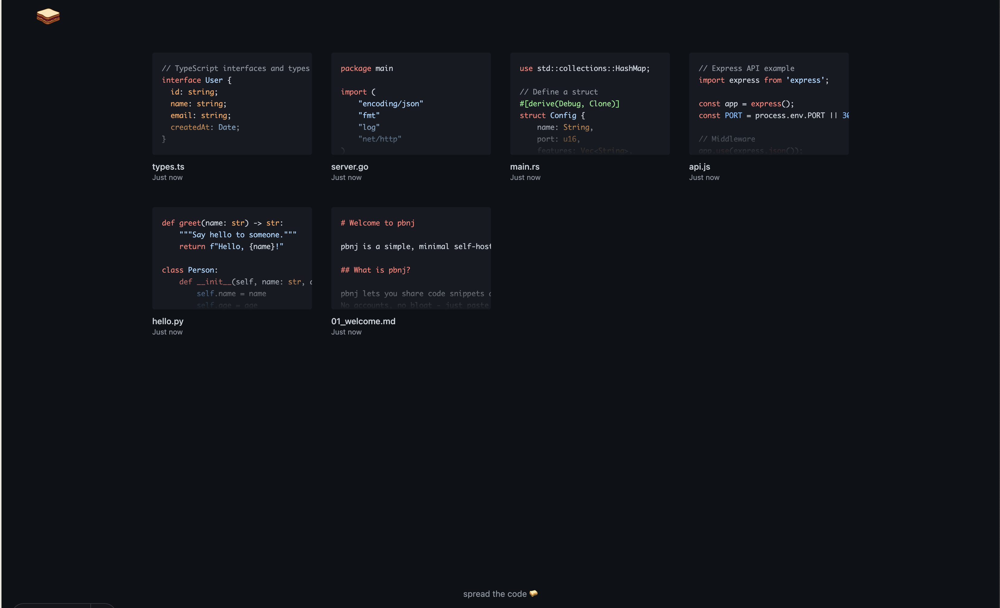 |
| GitHub Light | GitHub Dark |
|  | 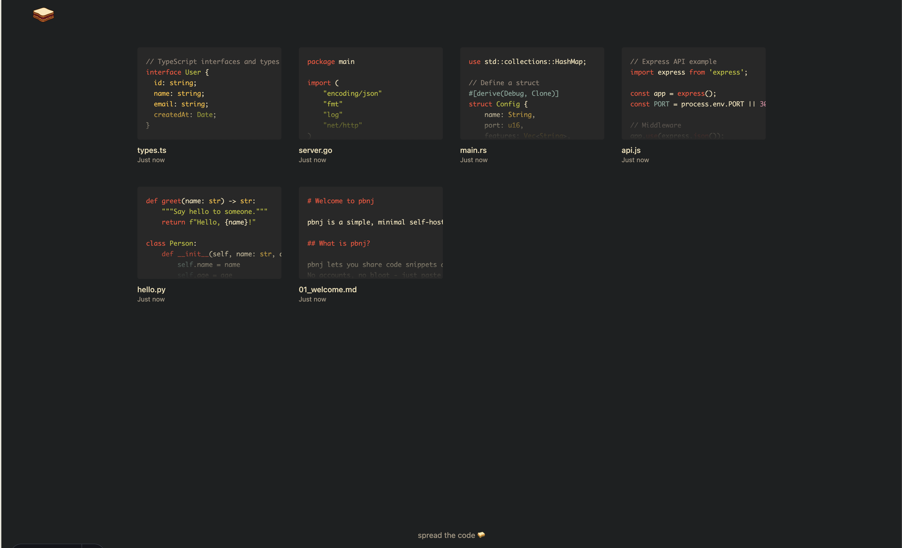 |
| Gruvbox Light | Gruvbox Dark |
| 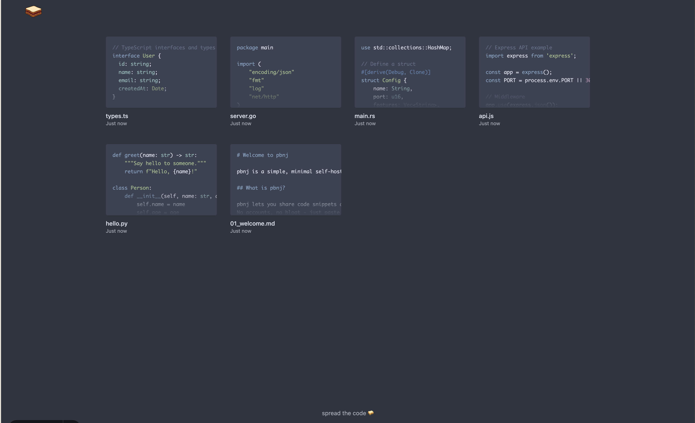 | 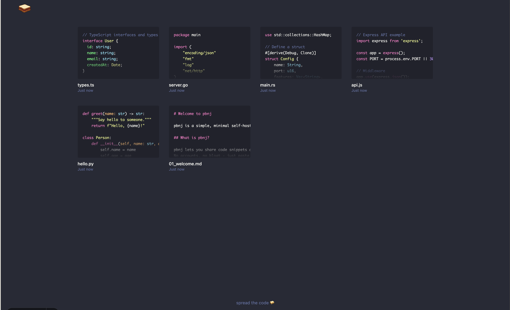 |
| Nord | Dracula |
| 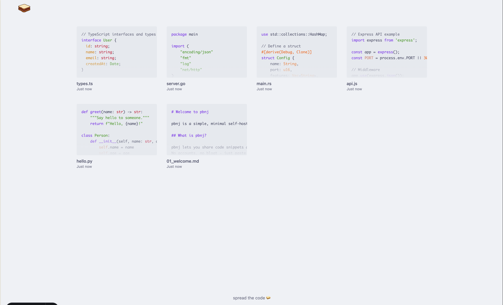 | 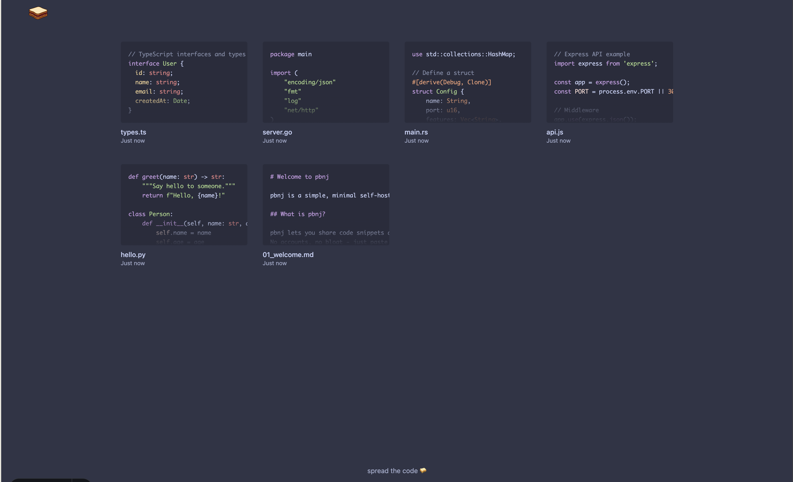 |
| Catppuccin Latte | Catppuccin Frappé |
| 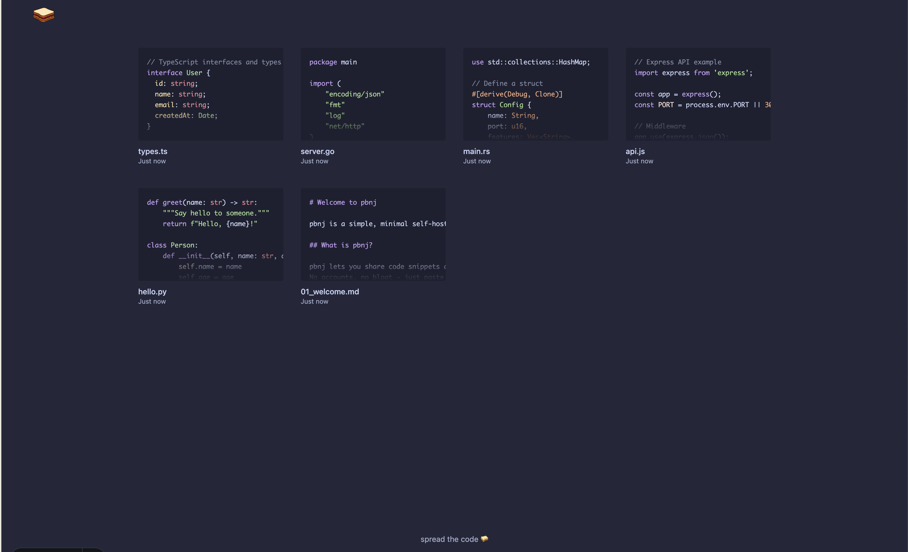 | 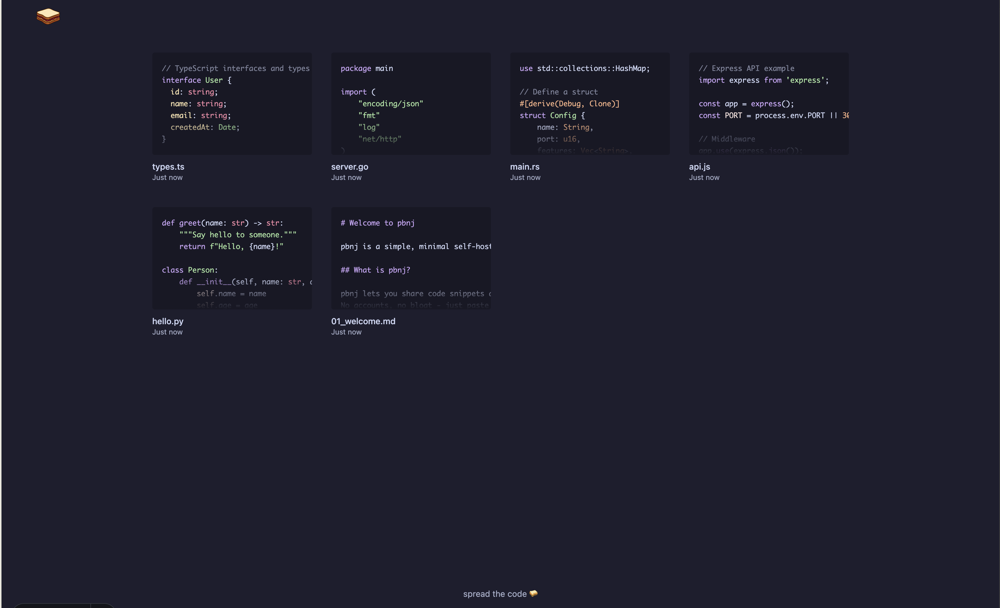 |
| Catppuccin Macchiato | Catppuccin Mocha |

</details>

## 🙋🏻‍♀️ Why?

Another pastebin? Really?

When I wanted to self-host a pastebin, I found plenty of options—but they were all *too much*. Git-based version control, OAuth, elaborate GUIs. I just wanted something I could deploy in under a minute with a CLI that actually works.

So I built this.

**Why not Gist?** Maybe you want to own your data. Maybe you don't want to depend on GitHub. Maybe you just like self-hosting things. Or maybe you're a little autistic like me and enjoy having your own stuff :)

**What makes pbnj different:**
- Actually beautiful — most feature-heavy pastebins look ugly
- Deploy in seconds with one click
- CLI-first workflow (`pbnj file.py` → done)
- No accounts, no git, no bloat
- Just paste and share
- Cloudflare's free tier will last you forever

## 💰 Cost

Now, I know some people might wonder, "This is deployed on Cloudflare, they might charge us eventually!" That's why I wrote this section. Let's do some basic math to figure out how much storage we can use:

**Cloudflare D1 Free Tier:**
- 500 MB storage
- 5 million reads/day
- 100,000 writes/day

**Typical paste sizes:**
- Small snippet: ~500 bytes
- Medium file: ~2-5 KB
- Large file: ~10-20 KB
- Average: ~5 KB

**The math:**
- 500 MB ÷ 5 KB = **~100,000 pastes**
- At 10 pastes/day = **27+ years** of storage
- At 50 pastes/day = **5+ years** of storage

For personal use, you'll never hit these limits. Even if you somehow do, D1's paid tier is just $0.75/GB-month. You'd need to be running a pretty popular pastebin to spend more than a few cents.

**TL;DR:** Cloudflare's free tier is more than enough. Stop worrying and start pasting.

## ⚡ Speedrun: Get Started Under a Minute!

**Step 1:** Click the deploy button above and follow the prompts. The most important here is to set the `AUTH_KEY` because you'd need that to make the pastes. Once you've clicked deploy, it takes about 25-30 seconds and your deployment will be ready! 

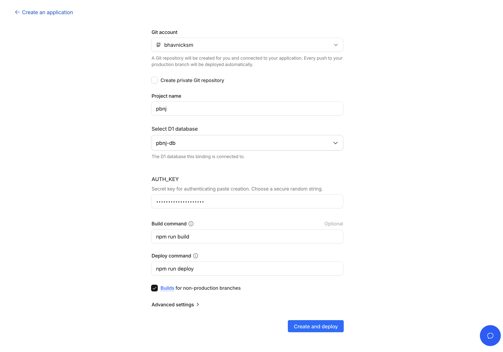

**Step 2:** Install the CLI
```bash
npm install -g @pbnjs/cli
```

**Step 3:** Configure it
```bash
pbnj --init
# Enter your worker URL and AUTH_KEY
```

**Step 4:** Paste!
```bash
pbnj myfile.py
# → https://your-pbnj.workers.dev/crunchy-peanut-butter-sandwich
```

That's it. You now have your own pastebin.

See [cli/README.md](./cli/README.md) for full CLI documentation.

## 🚫 Intentionally Missing

pbnj is opinionated. These features are **not bugs**—they're deliberate choices to keep things simple:

- **No git integration** — It's a pastebin, not a repository.
- **No OAuth/accounts** — Single user, single auth key. Done.
- **No multi-user support** — Fork it and run your own.
- **No comments/discussions** — Share code, not conversations.
- **No folders/organization** — The homepage is your feed.
- **No expiring pastes** — Your pastes live forever (or until you delete them).

If you need these features, check out [Opengist](https://github.com/thomiceli/opengist) or [PrivateBin](https://github.com/PrivateBin/PrivateBin)—they're great projects that take a different approach.

## 🙏 Acknowledgements

pbnj stands on the shoulders of giants. Shoutout to these awesome projects:

- [Opengist](https://github.com/thomiceli/opengist) — A self-hosted pastebin powered by Git
- [PrivateBin](https://github.com/PrivateBin/PrivateBin) — A minimalist, open source online pastebin with encryption
- [Hastebin](https://github.com/toptal/haste-server) — The OG open source pastebin
- [0x0.st](https://0x0.st) — The no-bullshit file hosting and URL shortener
- [Cloudflare Workers](https://workers.cloudflare.com) — For making serverless actually simple
- [Astro](https://astro.build) — The web framework that makes this possible

And to everyone who's ever pasted code to share with a friend—you're the reason this exists.

---

<div align="center">

If pbnj made your life a little easier, consider giving it a star ⭐

It helps others discover the project and makes me mass smile :)

[](https://github.com/bhavnicksm/pbnj)

</div>
